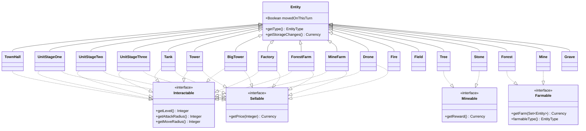
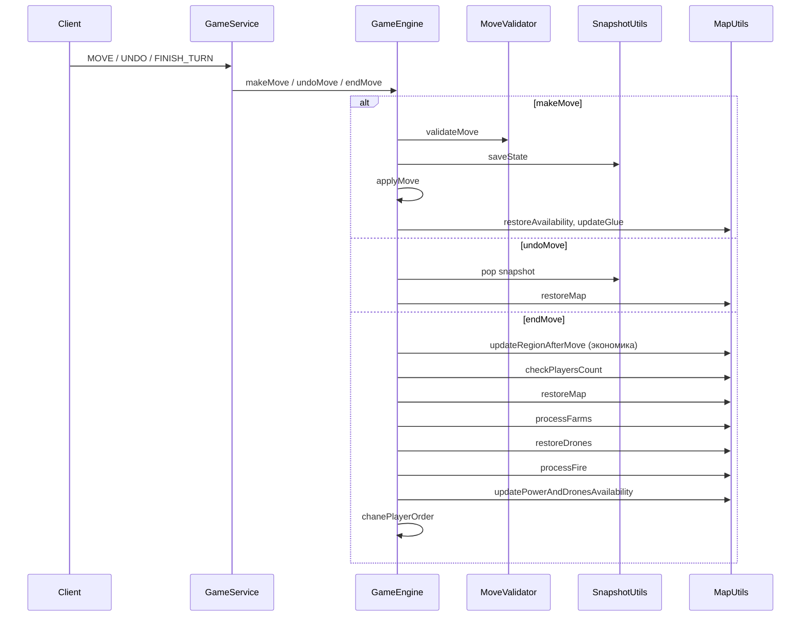

# Архитектура и механики игрового модуля `game`

> Модуль: `ru.bogatov.antiyoyo.game`.  
> Правила игры описаны в [`game-rules.md`](game-rules.md).

---

## 1. Общая архитектура

### 1.1. Границы модуля

Модуль `game` — это чистый игровой движок (game engine). Он не зависит от WebSocket, базы данных, HTTP и прочей серверной инфраструктуры, **за одним исключением**:

- [`GameEngine.handleBeforeMoveClick`](../../src/main/java/ru/bogatov/antiyoyo/game/engine/GameEngine.java) принимает параметр [`ru.bogatov.antiyoyo.server.domain.GameEvent`](../../src/main/java/ru/bogatov/antiyoyo/server/domain/GameEvent.java).

Это означает, что пакет `game` ссылается на пакет `server`. При рефакторинге желательно инвертировать зависимость: в `game` должен быть свой DTO для UI-события, а `server` уже адаптирует `GameEvent` в него.

### 1.2. Связь с сервером

Серверный [`GameService`](../../src/main/java/ru/bogatov/antiyoyo/server/service/GameService.java) владеет экземпляром [`GameEngine`](../../src/main/java/ru/bogatov/antiyoyo/game/engine/GameEngine.java) и транслирует клиентские события в вызовы движка:

| Событие от клиента | Вызов движка |
|--------------------|--------------|
| `MOVE` | `gameEngine.makeMove(session, move)` |
| `UNDO_MOVE` | `gameEngine.undoMove(session)` |
| `BEFORE_MOVE` | `gameEngine.handleBeforeMoveClick(session, event)` |
| `FINISH_TURN` | `gameEngine.endMove(session)` |

Создание сессии из карты происходит в [`GameService.createSessionFromMap`](../../src/main/java/ru/bogatov/antiyoyo/server/service/GameService.java): инициализация `GameSession`, валидация через движок, создание игроков, расчёт начальной экономики и мощности.

### 1.3. Пакеты

```
ru.bogatov.antiyoyo.game
├── Main.java                    // standalone-утилита для печати пустой карты, не используется сервером
├── engine
│   ├── GameEngine.java          // фасад движка
│   └── util                     // калькуляторы, валидаторы, утилиты
├── engine/v2                    // новый refactored движок (см. 1.4)
│   ├── GameEngineV2.java
│   ├── pipeline
│   └── service
├── model
│   ├── GameSession.java         // корневой агрегат состояния игры
│   ├── Player.java              // игрок
│   ├── Move.java                // ход/действие
│   ├── GameSetting.java         // настройки
│   └── common
│       ├── Hex.java             // клетка карты
│       ├── Vector3.java         // кубические координаты
│       ├── HexColor.java        // цвета
│       └── Currency.java        // ресурсы (золото/дерево/камень)
└── model/entity                 // иерархия сущностей
```

### 1.4. Новая архитектура v2 (`game.engine.v2`)

В пакете `ru.bogatov.antiyoyo.game.engine.v2` создана новая версия движка, которая не трогает старый код и повторяет публичный API [`GameEngine`](../../src/main/java/ru/bogatov/antiyoyo/game/engine/GameEngine.java) через [`GameEngineV2`](../../src/main/java/ru/bogatov/antiyoyo/game/engine/v2/GameEngineV2.java).

Основные идеи:

- **Pipeline обработки хода**: [`MovePipeline`](../../src/main/java/ru/bogatov/antiyoyo/game/engine/v2/pipeline/MovePipeline.java) состоит из стадий:
  1. [`ValidationStage`](../../src/main/java/ru/bogatov/antiyoyo/game/engine/v2/pipeline/stage/ValidationStage.java) — проверка хода.
  2. [`SnapshotStage`](../../src/main/java/ru/bogatov/antiyoyo/game/engine/v2/pipeline/stage/SnapshotStage.java) — сохранение/очистка истории undo.
  3. [`EventGenerationStage`](../../src/main/java/ru/bogatov/antiyoyo/game/engine/v2/pipeline/stage/EventGenerationStage.java) — сущности через behavior-интерфейсы порождают события.
  4. [`EventApplicationStage`](../../src/main/java/ru/bogatov/antiyoyo/game/engine/v2/pipeline/stage/EventApplicationStage.java) — применение событий к `GameSession`.
  5. [`PostProcessStage`](../../src/main/java/ru/bogatov/antiyoyo/game/engine/v2/pipeline/stage/PostProcessStage.java) — пересчёт защиты, регионов, экономики, мощности.

- **Общий контекст хода**: [`MoveContext`](../../src/main/java/ru/bogatov/antiyoyo/game/engine/v2/pipeline/MoveContext.java) хранит текущего игрока, тип хода, выбранный `TownHall`, клетки `from`/`to`, фича-флаги и кеш регионов.

- **Иммутабельные события**: [`MoveEvent`](../../src/main/java/ru/bogatov/antiyoyo/game/engine/v2/pipeline/event/MoveEvent.java) — sealed-интерфейс, реализованный record'ами (`EntityPlacedEvent`, `EntityMovedEvent`, `StorageChangedEvent` и др.). Каждое событие применяется своим [`EventApplier`](../../src/main/java/ru/bogatov/antiyoyo/game/engine/v2/pipeline/applier/EventApplier.java).

- **Behavior-интерфейсы**: [`Movable`](../../src/main/java/ru/bogatov/antiyoyo/game/engine/v2/pipeline/behavior/Movable.java), [`Purchasable`](../../src/main/java/ru/bogatov/antiyoyo/game/engine/v2/pipeline/behavior/Purchasable.java), [`Upgradable`](../../src/main/java/ru/bogatov/antiyoyo/game/engine/v2/pipeline/behavior/Upgradable.java), [`Harvestable`](../../src/main/java/ru/bogatov/antiyoyo/game/engine/v2/pipeline/behavior/Harvestable.java), [`Demolishable`](../../src/main/java/ru/bogatov/antiyoyo/game/engine/v2/pipeline/behavior/Demolishable.java). [`BehaviorResolver`](../../src/main/java/ru/bogatov/antiyoyo/game/engine/v2/pipeline/behavior/BehaviorResolver.java) сопоставляет старые entity-классы с поведением, не изменяя сами entity.

- **Доменные сервисы**: логика, ранее находившаяся в [`MapUtils`](../../src/main/java/ru/bogatov/antiyoyo/game/engine/util/MapUtils.java), разбита на [`RegionService`](../../src/main/java/ru/bogatov/antiyoyo/game/engine/v2/service/RegionService.java), [`DefenseService`](../../src/main/java/ru/bogatov/antiyoyo/game/engine/v2/service/DefenseService.java), [`EconomyService`](../../src/main/java/ru/bogatov/antiyoyo/game/engine/v2/service/EconomyService.java), [`PowerService`](../../src/main/java/ru/bogatov/antiyoyo/game/engine/v2/service/PowerService.java), [`FarmService`](../../src/main/java/ru/bogatov/antiyoyo/game/engine/v2/service/FarmService.java) и [`MapUIService`](../../src/main/java/ru/bogatov/antiyoyo/game/engine/v2/service/MapUIService.java).

Переключение сервера на новый движок выполняется заменой `new GameEngine()` на `new GameEngineV2()` в [`GameService`](../../src/main/java/ru/bogatov/antiyoyo/server/service/GameService.java).

---

## 2. Модель данных

### 2.1. [`GameSession`](../../src/main/java/ru/bogatov/antiyoyo/game/model/GameSession.java)

Корневой агрегат, хранимый в MongoDB (`@Document("sessions")`).

| Поле | Тип | Назначение |
|------|-----|------------|
| `id` | `UUID` | Идентификатор сессии. |
| `players` | `Map<Integer, Player>` | Игроки по порядковому индексу. |
| `map` | `Map<Vector3, Hex>` | Карта: координата → клетка. |
| `setting` | `GameSetting` | Настройки игры. |
| `currentPlayerMove` | `Integer` | Индекс текущего игрока. |
| `history` | `Stack<String>` | JSON-снапшоты для undo. |
| `powerByColor` | `Map<HexColor, Integer>` | Мощность по цветам. |
| `winnerId`, `endTime`, `started` | — | Состояние завершения игры. |

### 2.2. [`Hex`](../../src/main/java/ru/bogatov/antiyoyo/game/model/common/Hex.java)

Одна клетка гексагональной карты.

| Поле | Назначение |
|------|------------|
| `vector` | Кубические координаты ([`Vector3`](../../src/main/java/ru/bogatov/antiyoyo/game/model/common/Vector3.java)). |
| `color` | Цвет владельца ([`HexColor`](../../src/main/java/ru/bogatov/antiyoyo/game/model/common/HexColor.java)). |
| `entity` | Сущность на клетке ([`Entity`](../../src/main/java/ru/bogatov/antiyoyo/game/model/entity/Entity.java)). |
| `defenseLevel` | Уровень защиты клетки (максимальный `level` среди соседей). |
| `isAvailable` | Можно ли взаимодействовать с клеткой в текущем UI-состоянии. |
| `glue` | Принадлежит ли клетка выбранному региону (для подсветки). |
| `displayDefence` | Флаг отображения защиты для UI. |

### 2.3. [`Currency`](../../src/main/java/ru/bogatov/antiyoyo/game/model/common/Currency.java)

Ресурсы: `gold`, `tree`, `stone`. Основные операции:

- `add`, `remove`, `split`, `isAffordable`.
- `compareTo` основан на «мощности ресурсов»: `gold + 2*tree + 3*stone`.

### 2.4. [`Player`](../../src/main/java/ru/bogatov/antiyoyo/game/model/Player.java)

| Поле | Назначение |
|------|------------|
| `userId` | UUID пользователя. |
| `color` | Цвет игрока. |
| `selectedTownHall` | Выбранный город для покупки/экономики. |
| `isIlluminated` | «Выбыл ли игрок» (eliminated). |

### 2.5. [`Move`](../../src/main/java/ru/bogatov/antiyoyo/game/model/Move.java)

| Поле | Назначение |
|------|------------|
| `player` | Индекс игрока. |
| `from` | Откуда перемещаем сущность (`null` — покупка новой). |
| `to` | Куда перемещаем/ставим сущность. |
| `entityType` | Тип сущности, которую покупаем/ставим. |
| `redactorMode` | Если `true`, валидация отключается (режим редактора карт). |

---

## 3. Иерархия сущностей



### 3.1. [`EntityType`](../../src/main/java/ru/bogatov/antiyoyo/game/model/entity/EntityType.java)

Перечисление, используемое для сериализации сущностей (undo, MongoDB, сетевой обмен):

`BIG_TOWER, TOWER, FACTORY, FIELD, GRAVE, TREE, TOWN_HALL, UNIT_1, UNIT_2, UNIT_3, TANK, STONE, FOREST, MINE, FOREST_FARM, MINE_FARM, DRONE, FIRE`.

Фабрика — [`EntityUtils.fromType`](../../src/main/java/ru/bogatov/antiyoyo/game/engine/util/EntityUtils.java).

---

## 4. Жизненный цикл хода

### 4.1. Диаграмма последовательности



### 4.2. [`GameEngine.makeMove`](../../src/main/java/ru/bogatov/antiyoyo/game/engine/GameEngine.java)

1. Если не `redactorMode`, вызывает [`validateMove`](../../src/main/java/ru/bogatov/antiyoyo/game/engine/GameEngine.java).
2. Сохраняет текущее состояние карты в `history` ([`SnapshotUtils.makeSnapshot`](../../src/main/java/ru/bogatov/antiyoyo/game/engine/util/SnapshotUtils.java)).
3. Применяет ход ([`applyMove`](../../src/main/java/ru/bogatov/antiyoyo/game/engine/GameEngine.java)).
4. Восстанавливает флаги `isAvailable` ([`MapUtils.restoreAvailability`](../../src/main/java/ru/bogatov/antiyoyo/game/engine/util/MapUtils.java)).
5. Обновляет `glue` для выбранного региона ([`MapUtils.updateGlue`](../../src/main/java/ru/bogatov/antiyoyo/game/engine/util/MapUtils.java)).

### 4.3. [`GameEngine.applyMove`](../../src/main/java/ru/bogatov/antiyoyo/game/engine/GameEngine.java)

- Определяет `from`, `to`, `selfColor`.
- Если `from != null` — это перемещение существующей сущности. Исходная клетка заменяется на `Field` (кроме случая `Farmable` на целевой клетке — тогда движение пропускается, но цвет клетки меняется).
- Если `from == null` — покупка новой сущности; стоимость снимается с `selectedTownHall.storage`.
- Если целевая клетка — `Mineable`, в `TownHall.storage` добавляется награда.
- Вызывает [`setEntity`](../../src/main/java/ru/bogatov/antiyoyo/game/engine/GameEngine.java), который:
  - устанавливает сущность и цвет;
  - обрабатывает слияние юнитов ([`mergeUnit`](../../src/main/java/ru/bogatov/antiyoyo/game/engine/GameEngine.java));
  - обрабатывает дронов и огонь;
  - обновляет уровень защиты.
- После установки обновляет экономику выбранного `TownHall` и цены.

### 4.4. [`GameEngine.endMove`](../../src/main/java/ru/bogatov/antiyoyo/game/engine/GameEngine.java)

1. Очищает `history` (undo запрещён после завершения хода).
2. Для каждого региона текущего цвета вызывает [`MapUtils.updateRegionAfterMove`](../../src/main/java/ru/bogatov/antiyoyo/game/engine/util/MapUtils.java) (применяет `storageUpdate`, проверяет банкротство).
3. Проверяет условие победы ([`MapUtils.checkPlayersCount`](../../src/main/java/ru/bogatov/antiyoyo/game/engine/util/MapUtils.java)).
4. Сбрасывает UI-состояние ([`MapUtils.restoreMap`](../../src/main/java/ru/bogatov/antiyoyo/game/engine/util/MapUtils.java)).
5. Генерирует ресурсы от месторождений ([`MapUtils.processFarms`](../../src/main/java/ru/bogatov/antiyoyo/game/engine/util/MapUtils.java)).
6. Сбрасывает флаг движения дронов ([`MapUtils.restoreDrones`](../../src/main/java/ru/bogatov/antiyoyo/game/engine/util/MapUtils.java)).
7. Угасает огонь ([`MapUtils.processFire`](../../src/main/java/ru/bogatov/antiyoyo/game/engine/util/MapUtils.java)).
8. Пересчитывает мощность и доступность дронов ([`MapUtils.updatePowerAndDronesAvailability`](../../src/main/java/ru/bogatov/antiyoyo/game/engine/util/MapUtils.java)).
9. Переходит к следующему активному игроку ([`chanePlayerOrder`](../../src/main/java/ru/bogatov/antiyoyo/game/engine/GameEngine.java)).

### 4.5. [`GameEngine.undoMove`](../../src/main/java/ru/bogatov/antiyoyo/game/engine/GameEngine.java)

- Проверяет флаг `GameSetting.undoMove`.
- Берёт последний JSON-снапшот из `history`.
- [`SnapshotUtils.restoreSnapshot`](../../src/main/java/ru/bogatov/antiyoyo/game/engine/util/SnapshotUtils.java) восстанавливает клетки, `TownHall.storage`, флаги дронов, стадию огня, `movedOnThisTurn`.
- Вызывает [`MapUtils.restoreMap`](../../src/main/java/ru/bogatov/antiyoyo/game/engine/util/MapUtils.java).

---

## 5. Экономика

### 5.1. Расчёт дохода региона

Метод [`MapUtils.updateTownHallEconomy`](../../src/main/java/ru/bogatov/antiyoyo/game/engine/util/MapUtils.java):

```text
storageUpdate = 0
for each hex in region:
    if hex.entity is not Tree:
        storageUpdate.gold += 1
    if hex.entity is Farmable:
        storageUpdate += farmable.getFarm(neighbors)
    storageUpdate += hex.entity.getStorageChanges()
```

### 5.2. Базовые экономические характеристики сущностей

| Сущность | `getStorageChanges()` (золото/дерево/камень) | Примечание |
|----------|-----------------------------------------------|------------|
| `UnitStageOne` | −2 / 0 / 0 | Содержание рядового. |
| `UnitStageTwo` | −6 / 0 / 0 | Содержание солдата. |
| `UnitStageThree` | −18 / 0 / 0 | Содержание танка. |
| `Tank` | −36 / 0 / 0 | Содержание истребителя. |
| `Tower` | −2 / 0 / 0 | Содержание башни. |
| `BigTower` | −5 / 0 / 0 | Содержание большой башни. |
| `Factory` | +4 / 0 / 0 | Доход фермы. |
| `ForestFarm` | 0 / +2 / 0 | Доход лесопилки. |
| `MineFarm` | 0 / 0 / +2 | Доход завода. |
| `Forest` | 0 / +1 / 0 | Базовый доход месторождения дерева. |
| `Mine` | 0 / 0 / +1 | Базовый доход месторождения камня. |
| `Fire` | −stage / 0 / 0 | Штраф зависит от стадии (1–3). |

### 5.3. Бонусы месторождений от ферм

| Месторождение | Базовый доход | Бонус при соседстве с фермой | Итого |
|---------------|---------------|------------------------------|-------|
| `Forest` | +1 дерева | +5 дерева (если рядом `ForestFarm`) | +6 дерева |
| `Mine` | +1 камня | +5 камня (если рядом `MineFarm`) | +6 камня |

> Реализовано в `Farmable.getFarm`: [`Forest.getFarm`](../../src/main/java/ru/bogatov/antiyoyo/game/model/entity/Forest.java) и [`Mine.getFarm`](../../src/main/java/ru/bogatov/antiyoyo/game/model/entity/Mine.java).

### 5.4. Цены на покупку

| Сущность | Цена (золото/дерево/камень) | Особенности |
|----------|-----------------------------|---------------|
| `UnitStageOne` | 10 / 0 / 0 | — |
| `UnitStageTwo` | 20 / 0 / 0 | — |
| `UnitStageThree` | 30 / 1 / 1 | — |
| `Tank` | 40 / 2 / 2 | — |
| `Tower` | 5 / 5 / 5 | — |
| `BigTower` | 10 / 10 / 10 | — |
| `Factory` | 0 / (4 + n/2) / (2 + n/2) | `n` — количество уже построенных `Factory` в регионе. |
| `ForestFarm` | 10 / 0 / 0 | — |
| `MineFarm` | 10 / 0 / 0 | — |
| `Drone` | 5 / 0 / 0 | Доступность зависит от мощности. |

Цены обновляются в [`MapUtils.updatePricesForTownHall`](../../src/main/java/ru/bogatov/antiyoyo/game/engine/util/MapUtils.java).

### 5.5. Банкротство региона

В [`MapUtils.updateRegionAfterMove`](../../src/main/java/ru/bogatov/antiyoyo/game/engine/util/MapUtils.java):

1. К `TownHall.storage` добавляется `TownHall.storageUpdate`.
2. `Grave` превращается в `Tree`.
3. У всех `dieableUnits` сбрасывается `movedOnThisTurn = false`.
4. Если `storage.gold < 0`:
   - все `dieableUnits` в регионе превращаются в `Grave` (если `grave=true`) или `Field` (если `grave=false`);
   - `storage.gold` обнуляется.

---

## 6. Боевая система и защита

### 6.1. Уровень защиты клетки

[`MapUtils.calculateDefenseLevel`](../../src/main/java/ru/bogatov/antiyoyo/game/engine/util/MapUtils.java):

- Берётся максимальный `Interactable.getLevel()` среди клетки и её соседей в радиусе 1 того же цвета.
- `Tower` — уровень 2, `BigTower` — 3, `TownHall` — 1, юниты — их уровень.

### 6.2. Перемещение и атака

[`HexCalculator.getAvailableHexesForExistingEntity`](../../src/main/java/ru/bogatov/antiyoyo/game/engine/util/HexCalculator.java):

- BFS по своим клеткам + один шаг на вражескую клетку.
- Ограничение `moveRadius`.
- После BFS фильтруется через [`canMoveToEnemyHex`](../../src/main/java/ru/bogatov/antiyoyo/game/engine/util/HexCalculator.java) / [`canMoveToSelfHex`](../../src/main/java/ru/bogatov/antiyoyo/game/engine/util/HexCalculator.java).

[`canMoveToEnemyHex`](../../src/main/java/ru/bogatov/antiyoyo/game/engine/util/HexCalculator.java):

```java
!isSameColor(to, selfColor) && (to.getDefenseLevel() < entity.getLevel() || entity.getLevel() == 4)
```

То есть юнит может атаковать вражескую клетку, если его уровень выше защиты клетки. Исключение: `Tank` (уровень 4) игнорирует защиту.

### 6.3. Создание новых сущностей

[`HexCalculator.getAvailableHexesForNewEntity`](../../src/main/java/ru/bogatov/antiyoyo/game/engine/util/HexCalculator.java):

- Берётся регион выбранного `TownHall`.
- Для юнитов проверяется наличие «опорного» здания/юнита по соседству (зависит от уровня и настройки `cut`).
- Для `Factory` дополнительно фильтруется: клетка должна быть рядом с `Factory` или `TownHall`.
- Для `Field` ( demolition ) доступны только здания (`Factory`, `ForestFarm`, `MineFarm`) — см. [`getAvailableHexesForField`](../../src/main/java/ru/bogatov/antiyoyo/game/engine/util/HexCalculator.java).

### 6.4. Слияние юнитов

Реализовано в [`GameEngine.mergeUnit`](../../src/main/java/ru/bogatov/antiyoyo/game/engine/GameEngine.java):

| Сумма уровней | Результат |
|---------------|-----------|
| 2 | `UnitStageTwo` |
| 3 | `UnitStageThree` |
| 4 | `Tank` |

Слияние происходит, когда на своей клетке ставится юнит поверх другого юнита, и оба не являются дронами.

### 6.5. Дрон

[`Drone`](../../src/main/java/ru/bogatov/antiyoyo/game/model/entity/Drone.java):

- `moveRadius = 4`.
- `getPrice` = 5 золота.
- При покупке может быть поставлен только на свою свободную клетку (`Field`).
- При перемещении:
  - на свои `Field` — можно;
  - на вражеские `Field`, `Factory`, `MineFarm`, `ForestFarm`, `UnitStageOne`, `UnitStageTwo` — уничтожает цель.
- Если дрон уничтожает сущность, клетка становится `Fire`:
  - стадия 2 для `dieableUnits` (`UnitStageOne`, `UnitStageTwo`);
  - стадия по умолчанию 3 для остального (здания).

См. [`GameEngine.setEntity`](../../src/main/java/ru/bogatov/antiyoyo/game/engine/GameEngine.java).

---

## 7. Регионы и разрезы

### 7.1. Поиск региона

[`MapUtils.findTownHallWithRegion`](../../src/main/java/ru/bogatov/antiyoyo/game/engine/util/MapUtils.java):

- Запускает flood-fill от стартовой клетки по соседям того же цвета.
- Собирает все `TownHall` в регионе.
- Если `TownHall` несколько, выбирает тот, у кого `storage` больше (по `Currency.compareTo`); остальные `TownHall` превращаются в `Field`, а их ресурсы добавляются к главному.

### 7.2. Валидация регионов после захвата

[`GameEngine.validateTownHallsAndRegions`](../../src/main/java/ru/bogatov/antiyoyo/game/engine/GameEngine.java):

- После каждой смены цвета клетки перебирает все связные области.
- Если в области нет `TownHall`:
  - пытается создать новый в подходящей клетке ([`MapUtils.findPlaceForTownHall`](../../src/main/java/ru/bogatov/antiyoyo/game/engine/util/MapUtils.java));
  - если места нет — уничтожает всю область ([`MapUtils.killInRegion`](../../src/main/java/ru/bogatov/antiyoyo/game/engine/util/MapUtils.java)).
- Ресурсы уничтоженного `TownHall` делятся между всеми новыми `TownHall`, созданными при разрезе.

### 7.3. Уничтожение области

[`MapUtils.killInRegion`](../../src/main/java/ru/bogatov/antiyoyo/game/engine/util/MapUtils.java):

- Все `dieableUnits` превращаются в `Grave`/`Field`.
- `TownHall` и остальные сущности не обрабатываются явно (кроме потери цвета/защиты).

---

## 8. Мощность и дроны

### 8.1. Расчёт мощности региона

[`PowerCalculator.calculatePowerForRegion`](../../src/main/java/ru/bogatov/antiyoyo/game/engine/util/PowerCalculator.java):

```text
power = storage.gold + 2*storage.tree + 3*storage.stone
count = 1
for each hex in region:
    power += count + hexToPower(hex)
    count++
```

### 8.2. Мощность отдельных сущностей

[`PowerCalculator.hexToPower`](../../src/main/java/ru/bogatov/antiyoyo/game/engine/util/PowerCalculator.java):

| Сущность | Мощность |
|----------|----------|
| `Tree` | 6 |
| `Stone` | 9 |
| `Forest` | 6 |
| `ForestFarm` | 24 |
| `Mine` | 9 |
| `MineFarm` | 36 |
| `UnitStageOne` | 10 |
| `UnitStageTwo` | 20 |
| `UnitStageThree` | 30 |
| `Tank` | 40 |
| `Tower` | 15 |
| `BigTower` | 35 |
| `Factory` | 15 |
| всё остальное | 1 |

### 8.3. Лимит дронов

[`MapUtils.getDronesLimitFromDiff`](../../src/main/java/ru/bogatov/antiyoyo/game/engine/util/MapUtils.java):

```java
if (diff > 81) return 0;
if (diff > 64) return 1;
if (diff > 55) return 2;
if (diff > 46) return 3;
if (diff > 31) return 4;
return 5;
```

gде `diff = targetPower / maxPower * 100`.

Если лимит ≥ 1, у всех `TownHall` данного цвета устанавливаются `dronesAvailable = true` и `dronesLimit`. Также проверяется текущее количество дронов ([`MapUtils.getDronesCount`](../../src/main/java/ru/bogatov/antiyoyo/game/engine/util/MapUtils.java)) — если лимит достигнут, покупка запрещена ([`MapUtils.updateDronesFlag`](../../src/main/java/ru/bogatov/antiyoyo/game/engine/util/MapUtils.java)).

---

## 9. Огонь, могилы и разброс ресурсов

### 9.1. Огонь

- Создаётся в [`GameEngine.setEntity`](../../src/main/java/ru/bogatov/antiyoyo/game/engine/GameEngine.java) при уничтожении дроном.
- [`Fire`](../../src/main/java/ru/bogatov/antiyoyo/game/model/entity/Fire.java) имеет стадию 1–3.
- [`Fire.getStorageChanges`](../../src/main/java/ru/bogatov/antiyoyo/game/model/entity/Fire.java) возвращает `−stage` золота.
- В [`MapUtils.processFire`](../../src/main/java/ru/bogatov/antiyoyo/game/engine/util/MapUtils.java) стадия уменьшается на 1, при достижении 0 клетка становится `Field`.

### 9.2. Могилы

- Создаются в [`MapUtils.updateRegionAfterMove`](../../src/main/java/ru/bogatov/antiyoyo/game/engine/util/MapUtils.java) и [`killInRegion`](../../src/main/java/ru/bogatov/antiyoyo/game/engine/util/MapUtils.java), если `GameSetting.grave == true`.
- На следующем ходу `Grave` превращается в `Tree` (в `updateRegionAfterMove`).

### 9.3. Разброс ресурсов от месторождений

[`MapUtils.processFarms`](../../src/main/java/ru/bogatov/antiyoyo/game/engine/util/MapUtils.java):

- Для каждой клетки с `Farmable` (т.е. `Forest` или `Mine`) с шансом `farmsDensity` %:
  - `random.nextInt(2)` — количество новых клеток (0 или 1);
  - выбираются соседние `Field`;
  - создаются клетки типа `Farmable.farmableType()` (`TREE` для `Forest`, `STONE` для `Mine`).

---

## 10. Генерация карты и сериализация

### 10.1. Генерация пустой карты

[`HexMapGenerator.generateEmptyMap(size)`](../../src/main/java/ru/bogatov/antiyoyo/game/engine/util/HexMapGenerator.java):

- Создаёт гексагональную сетку радиуса `size`.
- Все клетки инициализируются `HexColor.EMPTY` + сущность `Field`.

### 10.2. Валидация карты

[`GameEngine.validateSessionAndGetPlayersCount`](../../src/main/java/ru/bogatov/antiyoyo/game/engine/GameEngine.java):

- Игроков должно быть от 2 до 8.
- Карта не должна быть пустой.
- Все клетки должны быть связны ([`MapUtils.validateAllHexAreAvailable`](../../src/main/java/ru/bogatov/antiyoyo/game/engine/util/MapUtils.java)).

### 10.3. Снапшоты

[`SnapshotUtils`](../../src/main/java/ru/bogatov/antiyoyo/game/engine/util/SnapshotUtils.java):

- [`makeSnapshot`](../../src/main/java/ru/bogatov/antiyoyo/game/engine/util/SnapshotUtils.java) сериализует набор [`HexSnapshot`](../../src/main/java/ru/bogatov/antiyoyo/game/model/entity/HexSnapshot.java) в JSON.
- [`restoreSnapshot`](../../src/main/java/ru/bogatov/antiyoyo/game/engine/util/SnapshotUtils.java) восстанавливает `Hex`, включая:
  - `TownHall.storage`, `dronesAvailable`, `dronesLimit`;
  - `Drone.ownerColor`;
  - `Fire.stage`;
  - `movedOnThisTurn`.

---

## 11. UI-подсветка перед ходом

[`GameEngine.handleBeforeMoveClick`](../../src/main/java/ru/bogatov/antiyoyo/game/engine/GameEngine.java):

- Сбрасывает `glue` на всех клетках.
- Если клик по взаимодействующей клетке своего цвета:
  - находит `TownHall` и регион ([`MapUtils.findTownHallWithRegion`](../../src/main/java/ru/bogatov/antiyoyo/game/engine/util/MapUtils.java));
  - сохраняет выбранный `TownHall` в `Player.selectedTownHall`;
  - обновляет цены ([`MapUtils.updatePricesForTownHall`](../../src/main/java/ru/bogatov/antiyoyo/game/engine/util/MapUtils.java));
  - обновляет флаги дронов ([`MapUtils.updateDronesFlag`](../../src/main/java/ru/bogatov/antiyoyo/game/engine/util/MapUtils.java));
  - пересчитывает экономику региона ([`MapUtils.updateTownHallEconomy`](../../src/main/java/ru/bogatov/antiyoyo/game/engine/util/MapUtils.java));
  - помечает клетки региона `glue = true`;
  - если сущность — башня, показывает радиус защиты ([`MapUtils.showDefenceForColor`](../../src/main/java/ru/bogatov/antiyoyo/game/engine/util/MapUtils.java));
  - иначе вычисляет доступные для перемещения клетки ([`HexCalculator.getAvailableHexesForExistingEntity`](../../src/main/java/ru/bogatov/antiyoyo/game/engine/util/HexCalculator.java)).
- Если клик по кнопке покупки (entityType задан, но клетка не выбрана), вычисляет доступные клетки для новой сущности ([`HexCalculator.getAvailableHexesForNewEntity`](../../src/main/java/ru/bogatov/antiyoyo/game/engine/util/HexCalculator.java)) или для demolition ([`HexCalculator.getAvailableHexesForField`](../../src/main/java/ru/bogatov/antiyoyo/game/engine/util/HexCalculator.java)).

---

## 12. Точки роста и рефакторинга

1. **Зависимость `game` → `server`**  
   [`GameEngine.handleBeforeMoveClick`](../../src/main/java/ru/bogatov/antiyoyo/game/engine/GameEngine.java) ссылается на [`server.domain.GameEvent`](../../src/main/java/ru/bogatov/antiyoyo/server/domain/GameEvent.java). Стоит ввести `game`-DTO и адаптер в `server`.

2. **`MapUtils` как God-class**  
   [`MapUtils`](../../src/main/java/ru/bogatov/antiyoyo/game/engine/util/MapUtils.java) ~570 строк, отвечает за регионы, экономику, защиту, дронов, огонь, могилы, фермы. Его можно разделить на:
   - `RegionService` — регионы и разрезы;
   - `EconomyService` — доход, цены, банкротство;
   - `CombatService` — защита, дроны, огонь;
   - `FarmService` — разброс ресурсов.

3. **`GameEngine.applyMove` / `setEntity`**  
   Содержат смешанную логику покупки, перемещения, слияния юнитов, дронов, огня, защиты. Можно выделить стратегии обработки разных типов `Move`.

4. **`HexCalculator`**  
   Смешивает чистую математику гексов (`distance`, `getNeighborsInRadius`) с игровыми правилами (доступные клетки, атака). Стоит разделить на `HexGeometry` и `MoveAvailabilityCalculator`.

5. **`Currency` как универсальная сумка**  
   Удобно, но из-за этого легко перепутать «цена», «доход», «штраф». Можно ввести типизированные значения (`Price`, `Income`, `Upkeep`) или хотя бы документировать контракты методов.

6. **Настройки и баланс**  
   Некоторые числа в `rules.html` и коде расходятся (например, доход `ForestFarm`/`MineFarm`, штраф дерева). При рефакторинге стоит единожды зафиксировать баланс в `GameSetting` или в конфигурационных константах, а не разбрасывать по классам.
