# Правила игры World Wars (Antiyoyo)

> Источник: [`src/main/resources/static/rules.html`](../../src/main/resources/static/rules.html).  
> В скобках даны ссылки на соответствующие классы кода игрового модуля `ru.bogatov.antiyoyo.game`.

---

## 1. Суть игры

Это стратегическая игра, где игроки управляют государствами, расширяют территории, добывают ресурсы и ведут тактическую борьбу за доминирование.

Побеждает тот, кто эффективнее развивает экономику, армию и контролирует ключевые точки на карте. Развивайте своё государство, подавляйте противников и станьте доминирующей силой на карте!

**Условие победы в коде**: остаётся один активный цвет или один активный игрок ([`MapUtils.checkPlayersCount`](../../src/main/java/ru/bogatov/antiyoyo/game/engine/util/MapUtils.java)).

---

## 2. Цвет и игроки

У каждого игрока есть свой цвет, и игра начинается с выбора цвета вашего государства.

Доступные цвета описаны в [`HexColor`](../../src/main/java/ru/bogatov/antiyoyo/game/model/common/HexColor.java): `RED`, `BLUE`, `GREEN`, `YELLOW`, `PURPLE`, `ORANGE`, `CIAN`, `PINK` и `EMPTY` (нейтральная клетка).

---

## 3. Ход

В игре есть иконки  и 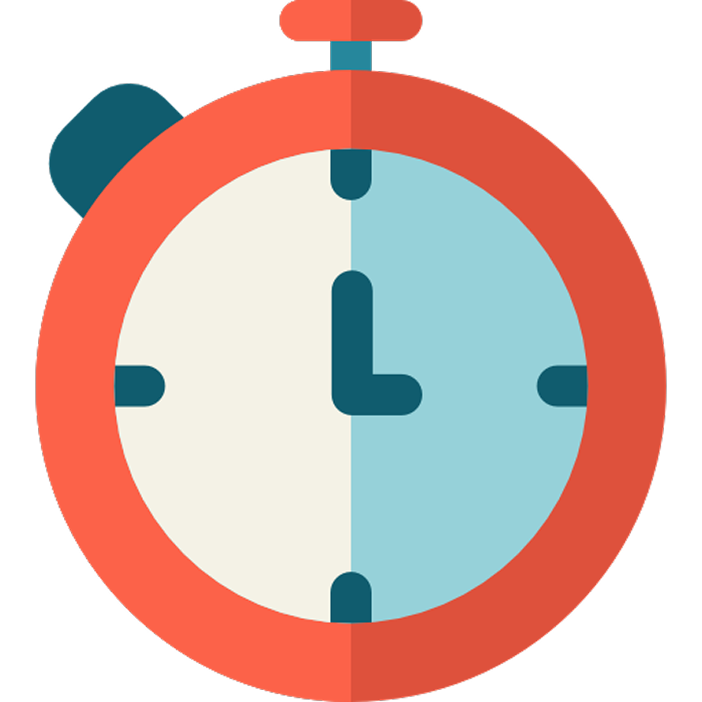, которые сообщают о текущем ходе. Таймер показывает оставшееся время до конца хода.

Иконки управления ходом:

- 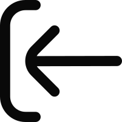 — отменить последнее действие на вашем ходу (если включена настройка `undoMove`).
-  — досрочно завершить ход.

**В коде**:

- Текущий игрок хранится в [`GameSession.currentPlayerMove`](../../src/main/java/ru/bogatov/antiyoyo/game/model/GameSession.java).
- Переход хода реализован в [`GameEngine.endMove`](../../src/main/java/ru/bogatov/antiyoyo/game/engine/GameEngine.java) → [`chanePlayerOrder`](../../src/main/java/ru/bogatov/antiyoyo/game/engine/GameEngine.java).
- Undo реализован в [`GameEngine.undoMove`](../../src/main/java/ru/bogatov/antiyoyo/game/engine/GameEngine.java) через [`SnapshotUtils`](../../src/main/java/ru/bogatov/antiyoyo/game/engine/util/SnapshotUtils.java).

---

## 4. Государство

У каждого цвета в игре есть своё главное здание — **государство**  ([`TownHall`](../../src/main/java/ru/bogatov/antiyoyo/game/model/entity/TownHall.java)). Их может быть несколько для каждого цвета.

За каждое отдельное государство своего цвета, выбрав его, можно совершать различные действия: создавать юнитов, строить фермы, заводы и башни. Соответственно у каждого отдельного государства есть своя территория и свои ресурсы.

**В коде**:

- У каждого `TownHall` есть `storage` (накопленные ресурсы), `storageUpdate` (изменение ресурсов в конце хода), `prices` (цены на покупку) и флаги дронов.
- Связь «город — регион» вычисляется в [`MapUtils.findTownHallWithRegion`](../../src/main/java/ru/bogatov/antiyoyo/game/engine/util/MapUtils.java).
- При разрезе территории лишние `TownHall` превращаются в `Field` (см. раздел «Разрезы»).

---

## 5. Ресурсы

В игре существует 3 вида ресурсов ([`Currency`](../../src/main/java/ru/bogatov/antiyoyo/game/model/common/Currency.java)):

| Ресурс | Иконка | Поле в `Currency` |
|--------|--------|-------------------|
| Золото | 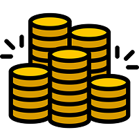 | `gold` |
| Дерево | 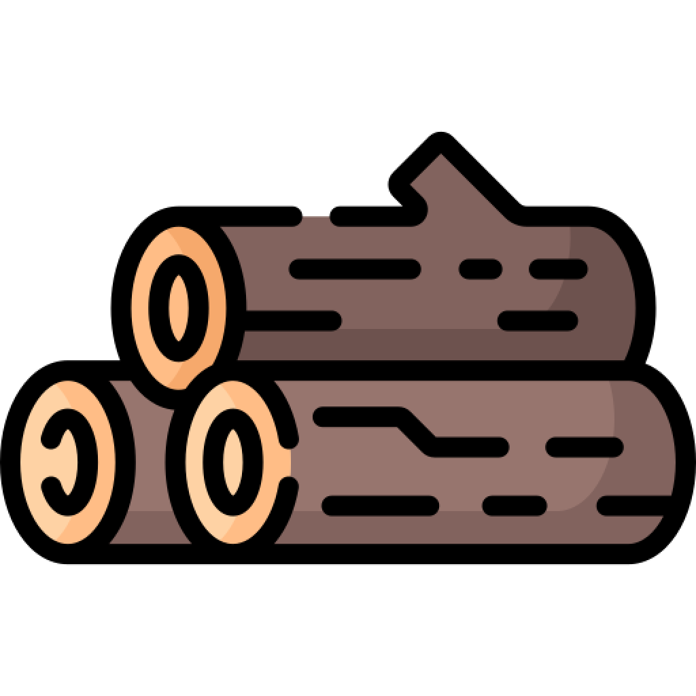 | `tree` |
| Камень | 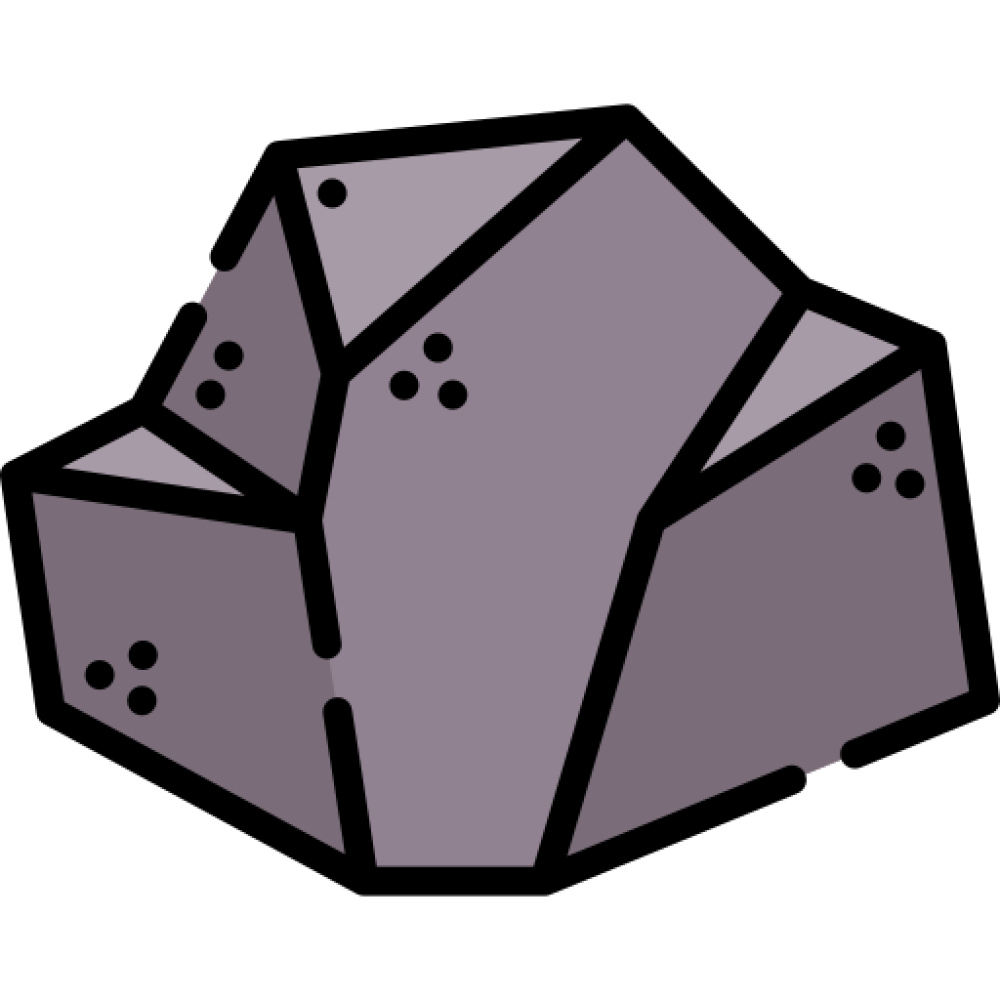 | `stone` |

### Золото

Золото добывается с помощью захваченных клеток: каждая клетка увеличивает доход на **+1** (кроме клеток с деревьями).

Также при построении ферм  ([`Factory`](../../src/main/java/ru/bogatov/antiyoyo/game/model/entity/Factory.java)) доход увеличивается на **+4** золота за ход, но ферма требует дерева и камня для строительства.

### Дерево и камень

Деревья и камни можно добыть тремя способами:

1. **Сбор единоразовых ресурсов** при перемещении своего юнита на клетку с ресурсом:
   - 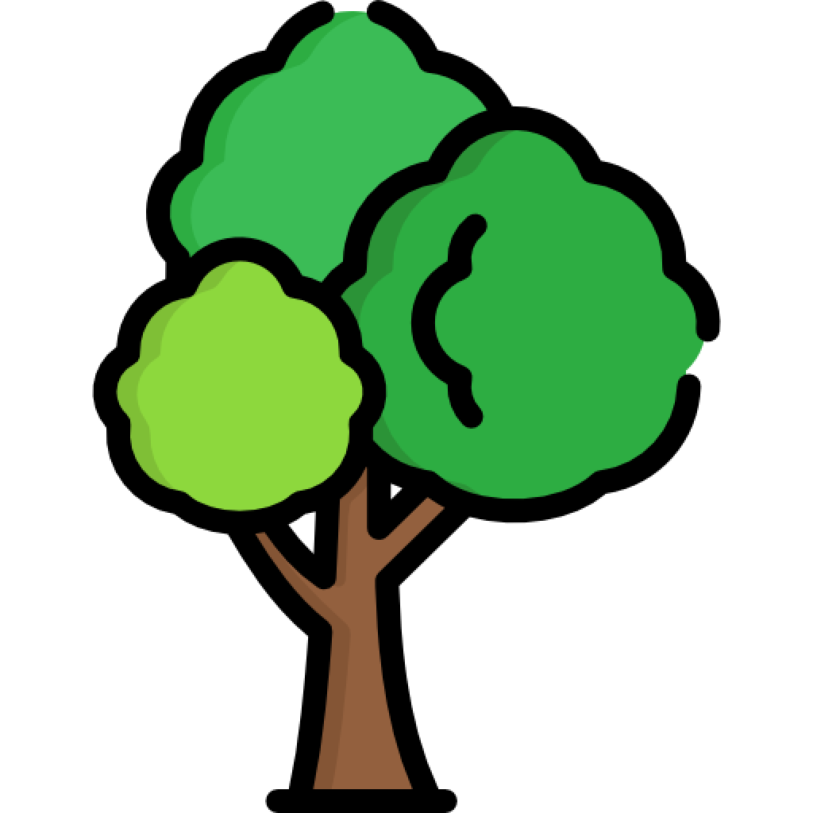 [`Tree`](../../src/main/java/ru/bogatov/antiyoyo/game/model/entity/Tree.java) — **+3 дерева**.
   - 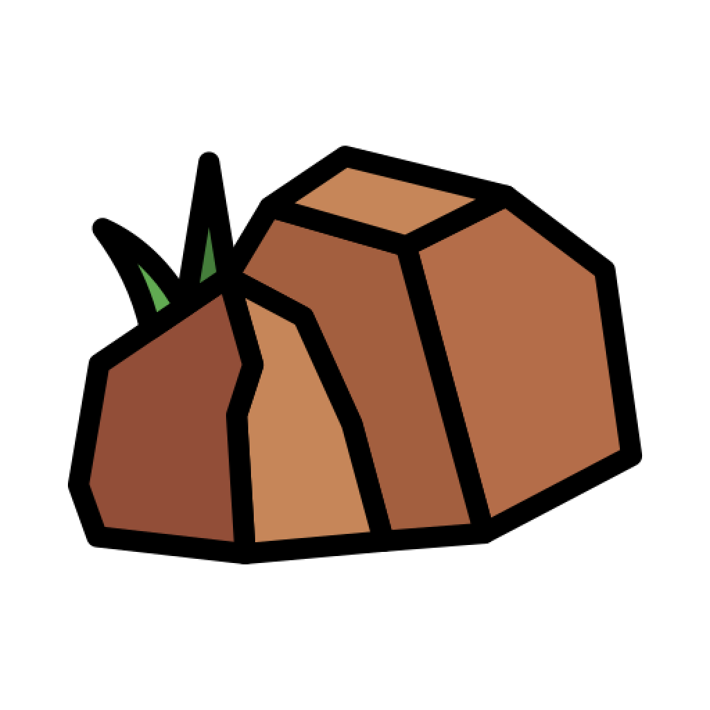 [`Stone`](../../src/main/java/ru/bogatov/antiyoyo/game/model/entity/Stone.java) — **+3 камня**.
2. **Захваченные месторождения**:
   - 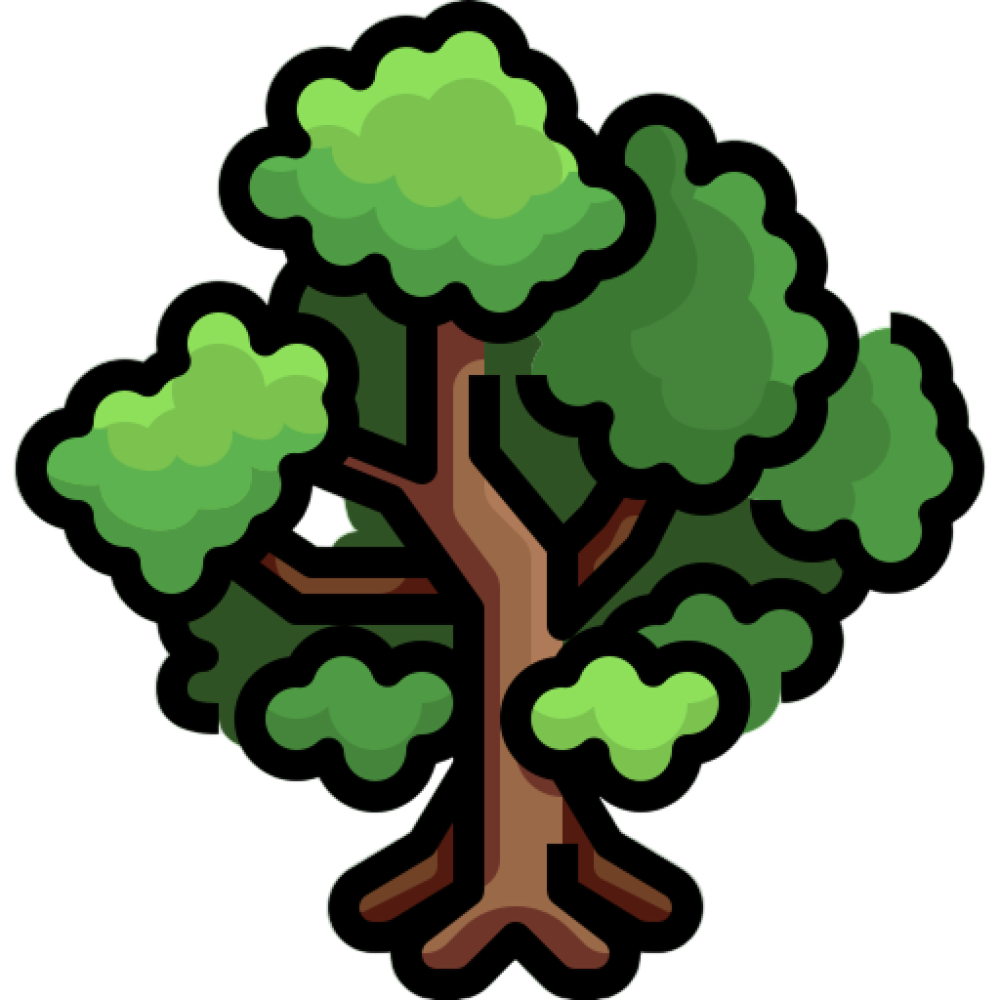 [`Forest`](../../src/main/java/ru/bogatov/antiyoyo/game/model/entity/Forest.java) даёт **+1 дерева** за ход.
   - 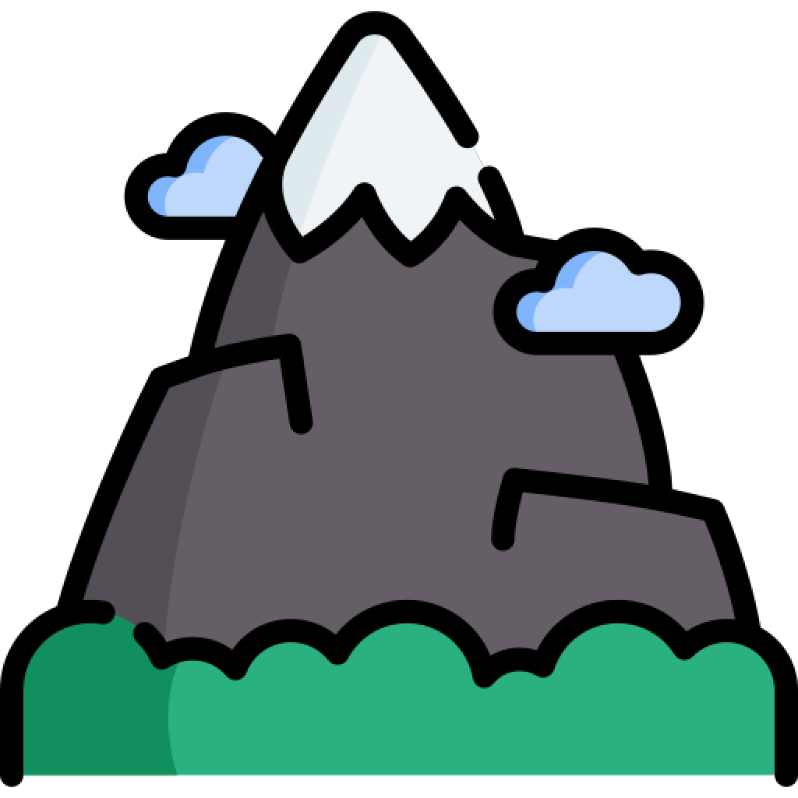 [`Mine`](../../src/main/java/ru/bogatov/antiyoyo/game/model/entity/Mine.java) даёт **+1 камня** за ход.
3. **Постройка лесопилки** 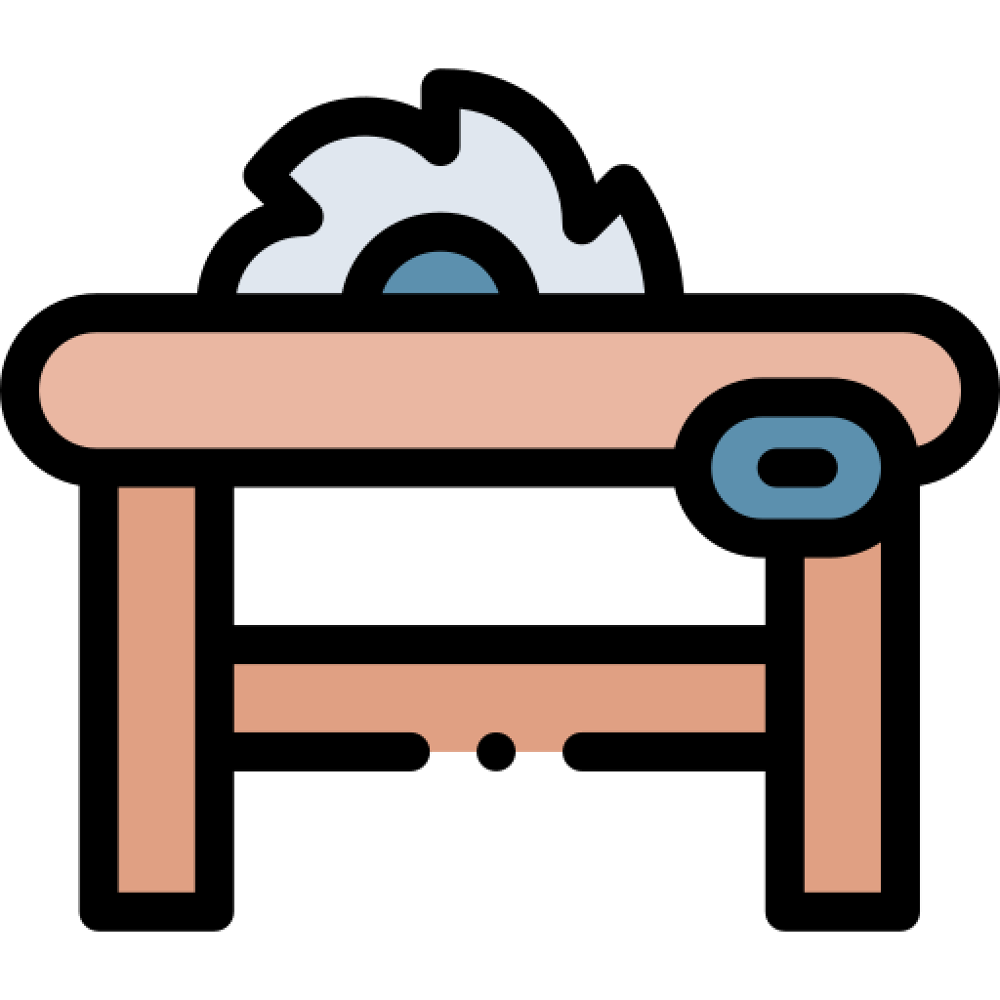 ([`ForestFarm`](../../src/main/java/ru/bogatov/antiyoyo/game/model/entity/ForestFarm.java)) и завода 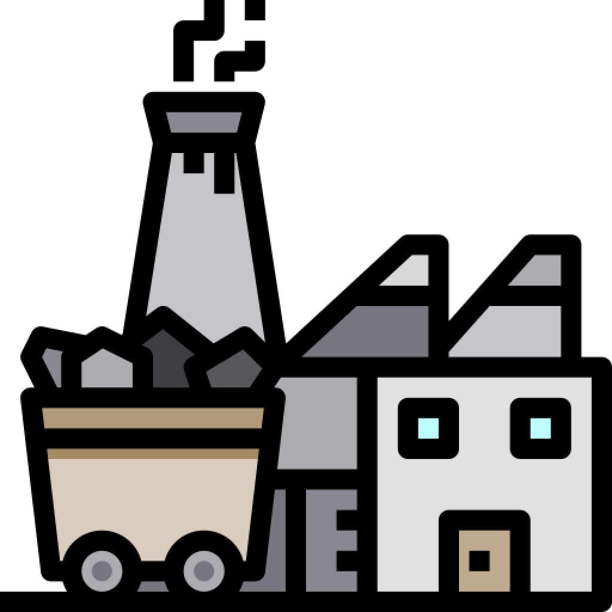 ([`MineFarm`](../../src/main/java/ru/bogatov/antiyoyo/game/model/entity/MineFarm.java)). Подробнее в разделе «Здания».

> **Примечание**: в коде [`MapUtils.updateTownHallEconomy`](../../src/main/java/ru/bogatov/antiyoyo/game/engine/util/MapUtils.java) дерево (`Tree`) не приносит +1 золота, но отдельного штрафа **–1** золота к доходу не применяется. В `rules.html` указано –1; при расхождении при рефакторинге ориентироваться на код.

---

## 6. Месторождения

 [`Forest`](../../src/main/java/ru/bogatov/antiyoyo/game/model/entity/Forest.java) и  [`Mine`](../../src/main/java/ru/bogatov/antiyoyo/game/model/entity/Mine.java) генерируют в радиусе 1 клетки от себя единоразовые ресурсы, если клетка свободна.

Месторождения остаются на всю игру и не могут быть уничтожены.

**В коде**:

- Разброс ресурсов в конце хода — [`MapUtils.processFarms`](../../src/main/java/ru/bogatov/antiyoyo/game/engine/util/MapUtils.java).
- Шанс генерации и максимальное количество новых клеток зависят от настройки `farmsDensity`.
- `Forest.farmableType()` → `TREE`, `Mine.farmableType()` → `STONE`.

---

## 7. Здания

Всего существует 4 здания:

| Здание | Иконка | Класс |
|--------|--------|-------|
| Государство |  | [`TownHall`](../../src/main/java/ru/bogatov/antiyoyo/game/model/entity/TownHall.java) |
| Ферма |  | [`Factory`](../../src/main/java/ru/bogatov/antiyoyo/game/model/entity/Factory.java) |
| Лесопилка |  | [`ForestFarm`](../../src/main/java/ru/bogatov/antiyoyo/game/model/entity/ForestFarm.java) |
| Завод |  | [`MineFarm`](../../src/main/java/ru/bogatov/antiyoyo/game/model/entity/MineFarm.java) |

### Ферма

- Строится только вокруг государства и других ферм.
- Каждая следующая ферма стоит дороже предыдущей:
  - базовая цена: `0` золота, `4` дерева, `2` камня;
  - за каждые 2 построенные фермы цена растёт на `0/1/1` ([`Factory.getPrice`](../../src/main/java/ru/bogatov/antiyoyo/game/model/entity/Factory.java)).
- Даёт **+4 золота** за ход ([`Factory.getStorageChanges`](../../src/main/java/ru/bogatov/antiyoyo/game/model/entity/Factory.java)).

### Лесопилка и завод

- Имеют фиксированную стоимость:
  - [`ForestFarm`](../../src/main/java/ru/bogatov/antiyoyo/game/model/entity/ForestFarm.java): `10` золота.
  - [`MineFarm`](../../src/main/java/ru/bogatov/antiyoyo/game/model/entity/MineFarm.java): `10` золота.
- Можно строить на любой своей клетке.
- [`ForestFarm`](../../src/main/java/ru/bogatov/antiyoyo/game/model/entity/ForestFarm.java) даёт **+2 дерева** за ход.
- [`MineFarm`](../../src/main/java/ru/bogatov/antiyoyo/game/model/entity/MineFarm.java) даёт **+2 камня** за ход.
- Если построить рядом с месторождением, доходность увеличивается:
  - [`Forest`](../../src/main/java/ru/bogatov/antiyoyo/game/model/entity/Forest.java) рядом с `ForestFarm` даёт **+5 дерева** (вместо базовых +1).
  - [`Mine`](../../src/main/java/ru/bogatov/antiyoyo/game/model/entity/Mine.java) рядом с `MineFarm` даёт **+5 камня** (вместо базовых +1).

> **Примечание**: в `rules.html` написано, что лесопилка/завод сами дают +1, а рядом с месторождением +3. В коде реализовано через `getStorageChanges` базовые +2 и бонус месторождения +5. При рефакторинге уточнить, какая формула является целевой.

---

## 8. Юниты

Всего есть 5 типов юнитов. Они отличаются стоимостью, содержанием, силой, защитой и радиусом хода.

Создание любого юнита на свободную клетку приравнивается к действию, а значит только созданным юнитом сходить не получится.

Сила юнита также является его защитой, которую он распространяет от себя в радиусе 1 для своих клеток.

### Войска

Войска могут быть созданы вокруг:

-  `TownHall`
-  `Factory`
- Башен:  `Tower` и  `BigTower`

| Юнит | Иконка | Сила/уровень | Содержание за ход | Цена | Радиус хода | Класс |
|------|--------|--------------|-------------------|------|-------------|-------|
| Рядовой |  | 1 | 2 золота | 10 золота | 3 | [`UnitStageOne`](../../src/main/java/ru/bogatov/antiyoyo/game/model/entity/UnitStageOne.java) |
| Солдат |  | 2 | 6 золота | 20 золота | 3 | [`UnitStageTwo`](../../src/main/java/ru/bogatov/antiyoyo/game/model/entity/UnitStageTwo.java) |
| Танк |  | 3 | 18 золота | 30 золота, 1 дерево, 1 камень | 3 | [`UnitStageThree`](../../src/main/java/ru/bogatov/antiyoyo/game/model/entity/UnitStageThree.java) |
| Истребитель |  | 4 | 36 золота | 40 золота, 2 дерева, 2 камня | 3 | [`Tank`](../../src/main/java/ru/bogatov/antiyoyo/game/model/entity/Tank.java) |

Все вышеперечисленные юниты имеют радиус хода в 3 клетки.

### Вложенность (настройка `cut`)

Существует вложенность: вокруг юнитов из войск можно создать более слабых юнитов.

- Вокруг истребителя (`Tank`, уровень 4) можно создать: `UnitStageThree`, `UnitStageTwo`, `UnitStageOne`.
- Вокруг `UnitStageTwo` (уровень 2) можно создать только `UnitStageOne`.

При создании учитывается защита ничейной или вражеской клетки.

> **Важный нюанс**: обычно создание юнита на свободную клетку — это действие, и новый юнит сразу ходить не может. Но с механикой вложенности можно «прокачать» одного юнита (который ещё не ходил) другим и затем им сходить. В коде это слияние реализовано в [`GameEngine.setEntity`](../../src/main/java/ru/bogatov/antiyoyo/game/engine/GameEngine.java) через [`mergeUnit`](../../src/main/java/ru/bogatov/antiyoyo/game/engine/GameEngine.java).

### Дрон

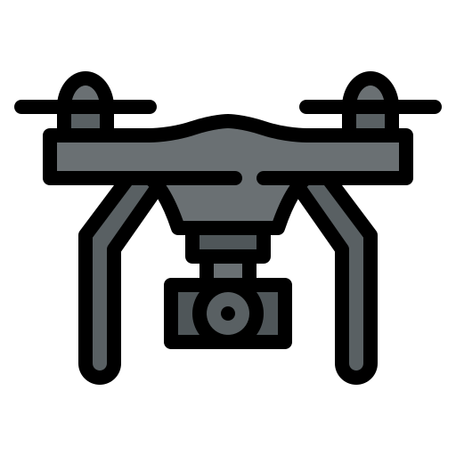 — последний тип юнитов ([`Drone`](../../src/main/java/ru/bogatov/antiyoyo/game/model/entity/Drone.java)).

- Радиус хода: **4 клетки**.
- Не важно, чьи это клетки и какая у них защита; главное требование — свободные (точнее, подходящие по типу сущности).
- При перемещении дрона на определённые сущности он их уничтожает, оставляя за собой огонь  ([`Fire`](../../src/main/java/ru/bogatov/antiyoyo/game/model/entity/Fire.java)).

Цели дрона:

- Вражеские юниты: `UnitStageOne`, `UnitStageTwo`.
- Вражеские здания: `Factory`, `ForestFarm`, `MineFarm`.

Дроны доступны только слабым государствам, и их количество зависит от разницы мощи с самым сильным государством в игре (см. раздел «Мощность»).

---

## 9. Башни

Башни служат для защиты своих клеток, распространяя свою защиту в радиусе 1 клетки вокруг себя.

| Башня | Иконка | Уровень защиты | Содержание за ход | Кто может сломать | Класс |
|-------|--------|----------------|-------------------|-------------------|-------|
| Башня 1 |  | 2 | 2 золота | Юниты уровня > 2: `UnitStageThree`, `Tank` | [`Tower`](../../src/main/java/ru/bogatov/antiyoyo/game/model/entity/Tower.java) |
| Башня 2 |  | 3 | 5 золота | Только `Tank` (уровень 4) | [`BigTower`](../../src/main/java/ru/bogatov/antiyoyo/game/model/entity/BigTower.java) |

Цена башен:

- `Tower` — 5 золота, 5 дерева, 5 камня.
- `BigTower` — 10 золота, 10 дерева, 10 камня.

---

## 10. Мощность

Мощность — показатель силы конкретного игрока/цвета. Складывается из:

- накопленных ресурсов в `TownHall`:
  - золото — 1 к 1;
  - дерево — ×2;
  - камень — ×3.
- сущностей на карте (см. [`PowerCalculator.hexToPower`](../../src/main/java/ru/bogatov/antiyoyo/game/engine/util/PowerCalculator.java)).

От мощности зависит только возможность создания дронов и их количество. В расчёте используются мощности самого сильного и вашего цветов.

Если ваша мощность составляет `target`, а максимальная — `max`, то отношение `target / max * 100%` определяет лимит дронов:

| Диапазон мощности (% от максимума) | Лимит дронов |
|------------------------------------|--------------|
| 82–100 % | 0 |
| 65–81 % | 1 |
| 56–64 % | 2 |
| 47–55 % | 3 |
| 32–46 % | 4 |
| 1–31 % | 5 |

> **Примечание**: в коде [`MapUtils.getDronesLimitFromDiff`](../../src/main/java/ru/bogatov/antiyoyo/game/engine/util/MapUtils.java) пороги строгие (`>81`, `>64`, `>55`, `>46`, `>31`), но практически совпадают с таблицей.

---

## 11. Огонь

Огонь  ([`Fire`](../../src/main/java/ru/bogatov/antiyoyo/game/model/entity/Fire.java)) появляется после уничтожения сущности дроном и блокирует использование клетки: нельзя переместиться на неё, строить здания и она не даёт экономический доход.

У огня 3 стадии: сильная, средняя и слабая. С каждым ходом игрока, имеющего у себя огонь, он угасает. Если огонь был слабый — он просто гаснет.

| Сущность, уничтоженная дроном | Стадия огня | Штраф к золоту за ход |
|-------------------------------|-------------|-----------------------|
| Здания (`Factory`, `ForestFarm`, `MineFarm`) | 3 (сильный) | −3 |
| `UnitStageTwo` (солдат) | 2 (средний) | −2 |
| `UnitStageOne` (рядовой) | 1 (слабый) | −1 |

В коде [`Fire.getStorageChanges`](../../src/main/java/ru/bogatov/antiyoyo/game/model/entity/Fire.java) возвращает `−stage` золота. При угасании (`MapUtils.processFire`) стадия уменьшается на 1, при достижении 0 клетка становится `Field`.

---

## 12. Экономика

Войска и башни содержатся за золото. Важно следить, чтобы доход золота покрывал потребности.

Доход может быть отрицательным, когда вы потребляете больше, чем добываете. Если накопленного золота не хватит для покрытия потребностей, то по завершению хода все имеющиеся войска погибнут, а на их месте появятся могилы  (или `Field`, если настройка `grave` выключена).

Таким образом вы избавляетесь от расходов на войско, но только через 1 ход вы сможете получать золото, потому что прошлое ушло на содержание войск.

**В коде**: [`MapUtils.updateRegionAfterMove`](../../src/main/java/ru/bogatov/antiyoyo/game/engine/util/MapUtils.java).

---

## 13. Могилы

 ([`Grave`](../../src/main/java/ru/bogatov/antiyoyo/game/model/entity/Grave.java)) — сигнал о том, что юниты погибли от недостатка финансирования государством.

Следующий этап могилы —  [`Tree`](../../src/main/java/ru/bogatov/antiyoyo/game/model/entity/Tree.java). Деревья появляются на следующий ход на месте могил на территории цвета, где есть `TownHall`. Если `TownHall` нет — могилы остаются.

---

## 14. Деревья

Деревья  ([`Tree`](../../src/main/java/ru/bogatov/antiyoyo/game/model/entity/Tree.java)), появившиеся от могил или от месторождения [`Forest`](../../src/main/java/ru/bogatov/antiyoyo/game/model/entity/Forest.java), уменьшают доход золота государства, но их можно собрать в качестве ресурсов (+3 дерева).

> В коде [`Tree`](../../src/main/java/ru/bogatov/antiyoyo/game/model/entity/Tree.java) не даёт +1 золота, но отдельного вычитания −1 нет. См. примечание в разделе «Ресурсы».

---

## 15. Разрезы

Если вражеский игрок захватывает клетку внутри вашей территории и разделяет её на две несвязные части, происходит следующее:

1. Для отделённой части пытаемся создать новый `TownHall` в свободной клетке ([`MapUtils.findPlaceForTownHall`](../../src/main/java/ru/bogatov/antiyoyo/game/engine/util/MapUtils.java)).
2. Если свободной клетки нет — вся отделённая часть погибает ([`killInRegion`](../../src/main/java/ru/bogatov/antiyoyo/game/engine/util/MapUtils.java)).
3. Ресурсы старого `TownHall` делятся между всеми новыми `TownHall`, созданными при разрезе ([`validateTownHallsAndRegions`](../../src/main/java/ru/bogatov/antiyoyo/game/engine/GameEngine.java)).
4. Каждый новый регион получает своё экономическое обновление; если золото уходит в минус — юниты погибают.

Пример из `rules.html`: прямая из 11 клеток красного игрока, государство на клетке 1, юниты на 2 и 9. После разреза на клетке 6 синим игроком красная территория делится на [1,5] и [7,11].

---

## 16. Разрушение своих зданий

В игру добавлена возможность разрушать здания. Она работает только при включённой настройке  `demolition`.

Можно сломать своё здание (`Factory`, `ForestFarm`, `MineFarm`) и получить половину затраченных ресурсов. Механика не применима к башням, юнитам и `TownHall`.

**В коде**: [`GameEngine.applyMove`](../../src/main/java/ru/bogatov/antiyoyo/game/engine/GameEngine.java), ветка `EntityType.FIELD` + `Sellable`, возврат `price.split(2)`.

---

## 17. Тактика

- В начале игры важно захватить ничейные клетки и месторождения.
- Не допускайте потерю клеток и защищайте месторождения — лучшие источники ресурсов.
- Прежде чем строить сильных юнитов, убедитесь, что прибыль покрывает затраты на их содержание.
- Разрезайте территории врагов на части, чтобы разрушить их экономику и уничтожить войска.

---

## 18. Настройки игры

Настройки хранятся в [`GameSetting`](../../src/main/java/ru/bogatov/antiyoyo/game/model/GameSetting.java):

| Иконка | Настройка | Описание |
|--------|-----------|----------|
|  | `grave` | Включает появление могил при гибели юнитов от нехватки золота. Если выключено — юниты превращаются в `Field`. |
|  | `undoMove` | Позволяет отменять последние действия во время хода. |
| 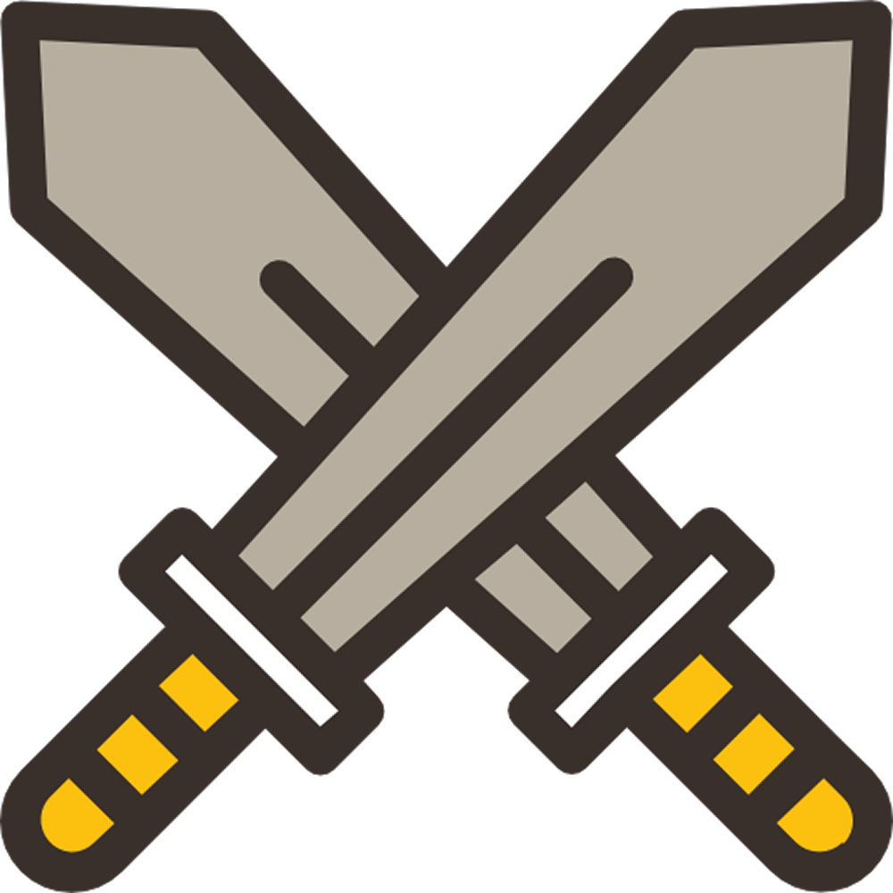 | `cut` | Позволяет создавать более слабых юнитов вокруг сильных. |
|  | `demolition` | Возможность разрушать свои здания с возвратом половины стоимости. |
| — | `secondsToMove` | Время хода в секундах для каждого игрока. |
| — | `farmsDensity` | Интенсивность появления ресурсов вокруг месторождений (`Forest`/`Mine`). Значение от 0 до 100. |

---

## 19. Заключение

Теперь ты готов к битве!

- На странице **LOBBIES** можно найти подходящую карту и создать игру с различными настройками.
- На странице **CREATE** можно создать свою карту.
- На странице **PLAY** можно присоединиться к уже созданным играм.
- На странице аккаунта накапливается статистика: сыгранные игры, победы, рейтинг и история.
- На странице **RATINGS** можно ознакомиться с топами игроков.

Удачи!
